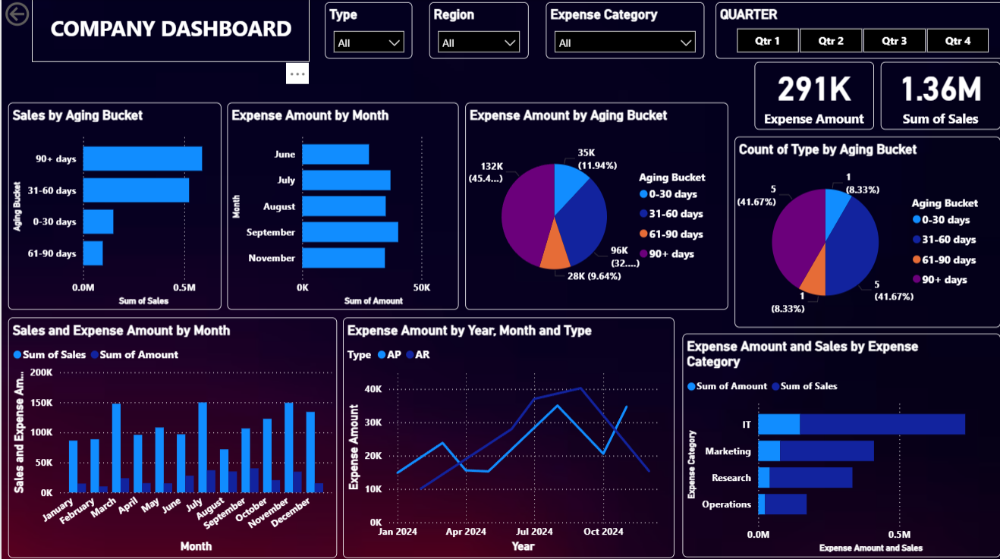

# **HR Attrition Dashboard – Power BI Project**  

📊 **Author:** Jaskirat Singh  

# **📌 Project Overview**  
This project analyzes **HR analytics and employee attrition** using a **Power BI dashboard**. The goal is to identify factors affecting **employee retention, job satisfaction, and salary trends**, enabling organizations to make data-driven decisions.  

# **📂 Dataset Details**  
- **File Used:** `mock_data.xlsx`
- **Total Records:** 12  
- **Key Features:**  
  - **Employee Demographics:** Age, Gender, Marital Status, Education Field  
  - **Work & Compensation:** Department, Job Role, Monthly Income, Salary Trends  
  - **Performance & Satisfaction:** Job Involvement, Work-Life Balance, Performance Rating  
  - **Attrition Factors:** Distance from Home, Overtime, Promotions, Training History  

# **📊 Dashboard Features**  
🔹 **Overall Attrition Rate:** Displays total employees, attrition % by department, and key trends  
🔹 **Salary & Compensation Analysis:** Monthly income distribution and impact on attrition  
🔹 **Work-Life Balance vs. Attrition:** Insights into working hours and satisfaction levels  
🔹 **Promotion & Career Growth Analysis:** Examines promotion trends and career progression  
🔹 **Departmental Breakdown:** Attrition comparison across different departments and roles  

# **🛠️ Tools Used**  
✔ **Power BI** – Data visualization & analytics  
✔ **DAX (Data Analysis Expressions)** – Custom calculations & measures  
✔ **Excel** – Data preprocessing & transformation  

# **🚀 How to Use**  
1️⃣ Download the **Sample.pbix** file from this repository  
2️⃣ Open it in **Power BI Desktop**  
3️⃣ Explore the interactive dashboard & insights  

# **📬 Contact Me**  
📧 Email: jaskiratt.16@gmail.com  
🔗 LinkedIn: https://www.linkedin.com/in/-jaskiratsingh- 

# **⭐ If you find this project helpful, consider starring this repository!** 🚀✨  
